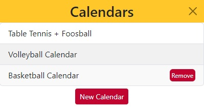
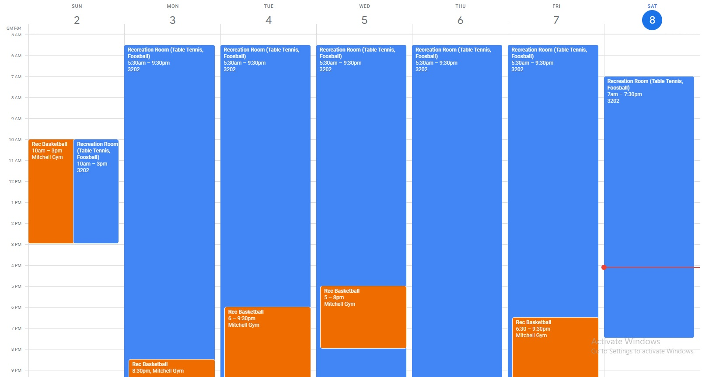

# Guelph Drop-In Sync
[Chrome Web Store Link](https://chrome.google.com/webstore/detail/guelph-drop-in-sync/dcjfimkbgpdgmbfpnhboaceildfgaehh?hl=en&authuser=1)

## Project Description
This Google Chrome Extension allows you to link your Google Calendar with the University of Guelph's Drop-In Recreation Calendar. You have the abilitiy to create/delete calendars which will sync to your Google account. Upon creating a calendar, you can select the calendar name that will appear on your Google Calendar as well as the activities you want it to sync to your calendar. It will keep your Google Calendar up to date in perpituity as long as the activities are being offered that week in the Fitness Center.

## Screenshots

## Languages & Technologies
- Javascript, HTML, CSS
- Bootstrap, Chrome Extensions API, Google Calendar API, jQuery, REST

## Possible Improvements
- Chrome Extension prompts for access to your Google Calendar on install
- Loading icon once you create a calendar
- Page for customizing selected activities
    - Colour of event
    - Colour for calendar
    - Time
    - Add custom event to search for
- Overview/Edit/Delete Option in main menu
    - Overview lets you see what activities are added and how many (saved to chrome storage)
- List of possible options grows by automatic scraping

## References
* [Drop-In Rec Calendar](https://fitandrec.gryphons.ca/sports-clubs/drop-in-rec)
* [Formatting a Readme](https://docs.github.com/en/get-started/writing-on-github/getting-started-with-writing-and-formatting-on-github/basic-writing-and-formatting-syntax)